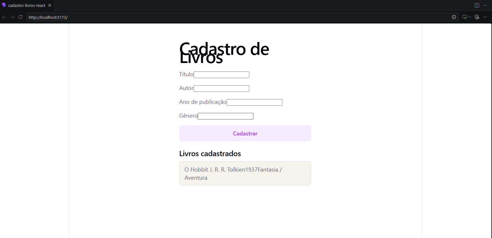

# Cadastro de Livros — React

Atividade prática de Programação para Internet (IFRN — Campus Pau dos Ferros). Formulário de cadastro de livros feito em React, com componentes reutilizáveis, estado local (useState) e renderização de listas.

## Print



## Como rodar

```bash
git clone https://github.com/Wallysom-fer/cadastro-livros-react.git
cd cadastro-livros-react
npm install
npm run dev